This is the demo website for the paper.

Authors: [Yen-Tung Yeh](https://arthurddd.github.io/), [Bo-Yu Chen](https://paulyuchen.com/), [Yi-Hsuan Yang](http://mac.citi.sinica.edu.tw/~yang/)

[Paper]() | [Github](https://github.com/Arthurddd/pjloop-gan) 

### Demo Video

<iframe width="560" height="315" src="https://www.youtube.com/embed/aLihSFbjzoI" title="YouTube video player" frameborder="0" allow="accelerometer; autoplay; clipboard-write; encrypted-media; gyroscope; picture-in-picture" allowfullscreen></iframe>

We used the [work](https://codepen.io/prakhar625/pen/zddKRj?fbclid=IwAR1UadLgl4AN6zvDdK6R3WROVMSeWjlYWNxpJ47nrun-n9g1TkA-tj6XWLI%29) by Prakhar Bhardwaj as our audio visualizer, and thanks to [Amanda Yeh](beauty90212@gmail.com) for editing the video. 

This is the demo video for PjLoopGAN. We generated drum loops and synth loops separately and make music with our generated samples. To be more specific, we generated 6 one-bar drum loops and interpolate between each of them, so-called style-mixing. By doing this way, we can generate a sequence of loops that gradually changed from each other. This is a special characteristic of machine learning. Moreover, we have found some interesting properties. For drum loops, the generated samples by style mixing sounds good. However, synth loops sometimes are not. The quality of generated synth loops by style mixing is not dependant on the endpoint (endpoint means the two loops we tried to interpolate). Even the quality of both endpoint is good, sometimes the generated sample by style-mixing is not good. AI-generated music still need progress.

### Introduction 

In this webpage, we provide audio examples of the one-bar drum loops and one-bar synth loops generated by different generative models, including StyleGAN2, ProjectedStyleGAN2 (VGG), ProjectedStyleGAN2 (SCNN on Loop), and ProjectedStyleGAN2 (Fusion).
We also provide real data for comparison.

We show the result for the models trained on the large-scale looperman dataset. 

### Model Architecture 

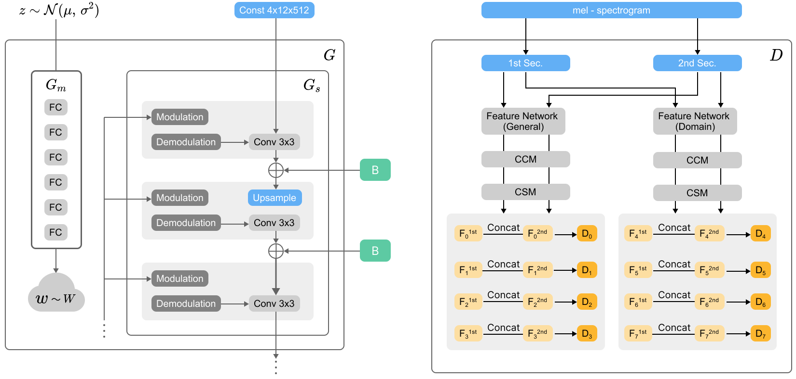

We show our model architecture above. Our generator model is almost same as the original StyleGAN2 generator. However, we make some slight changes. First, we only use 6 layers of mapping networks. Second, we modify the input z to 32. We experimentally find out these settings can lead to better results. 

For the discriminator, we mainly follow the Projected GAN architecture. Before feeding to the CCM and CSM module, we split our generated samples into two chunks. It is because we pre-trained our feature networks on one-second audio, but we aim to generate two-second audio.

### Demo audio

#### Drum Loops

* Real

    

        <audio src="demo_page/ProjectedGAN/Drum/Real/2.wav" controls="" preload=""></audio>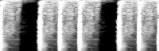
    

    

        <audio src="demo_page/ProjectedGAN/Drum/Real/152.wav" controls="" preload=""></audio>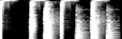
    

    

        <audio src="demo_page/ProjectedGAN/Drum/Real/277.wav" controls="" preload=""></audio>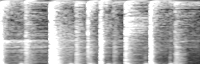
    

    

        <audio src="demo_page/ProjectedGAN/Drum/Real/371.wav" controls="" preload=""></audio>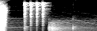
    

    

        <audio src="demo_page/ProjectedGAN/Drum/Real/497.wav" controls="" preload=""></audio>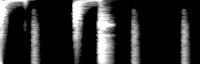
    

    

        <audio src="demo_page/ProjectedGAN/Drum/Real/501.wav" controls="" preload=""></audio>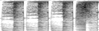
    

* StyleGAN2

    

        <audio src="demo_page/ProjectedGAN/Drum/StyleGAN2/2.wav" controls="" preload=""></audio>
    

    

        <audio src="demo_page/ProjectedGAN/Drum/StyleGAN2/249.wav" controls="" preload=""></audio>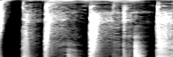
    

    

        <audio src="demo_page/ProjectedGAN/Drum/StyleGAN2/596.wav" controls="" preload=""></audio>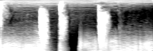
    

    

        <audio src="demo_page/ProjectedGAN/Drum/StyleGAN2/1001.wav" controls="" preload=""></audio>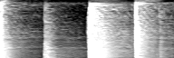
    

    

        <audio src="demo_page/ProjectedGAN/Drum/StyleGAN2/1226.wav" controls="" preload=""></audio>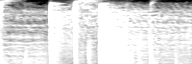
    

    

        <audio src="demo_page/ProjectedGAN/Drum/StyleGAN2/1505.wav" controls="" preload=""></audio>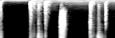
    

* Projected StyleGAN2 (VGG)

    

        <audio src="demo_page/ProjectedGAN/Drum/VGG/5.wav" controls="" preload=""></audio>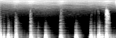
    

    

        <audio src="demo_page/ProjectedGAN/Drum/VGG/1005.wav" controls="" preload=""></audio>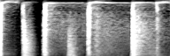
    

    

        <audio src="demo_page/ProjectedGAN/Drum/VGG/1413.wav" controls="" preload=""></audio>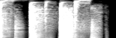
    

    

        <audio src="demo_page/ProjectedGAN/Drum/VGG/1500.wav" controls="" preload=""></audio>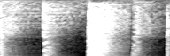
    

    

        <audio src="demo_page/ProjectedGAN/Drum/VGG/2501.wav" controls="" preload=""></audio>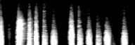
    

    

        <audio src="demo_page/ProjectedGAN/Drum/VGG/3506.wav" controls="" preload=""></audio>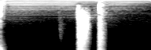
    

* Projected StyleGAN2 (SCNNLoop)

Note: Turn down the volume first. It is pretty loud and noisy.

    

        <audio src="demo_page/ProjectedGAN/Drum/SCNN/0.wav" controls="" preload=""></audio>
    

    

        <audio src="demo_page/ProjectedGAN/Drum/SCNN/1.wav" controls="" preload=""></audio>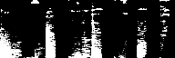
    

    

        <audio src="demo_page/ProjectedGAN/Drum/SCNN/2.wav" controls="" preload=""></audio>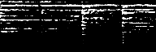
    

    

        <audio src="demo_page/ProjectedGAN/Drum/SCNN/3.wav" controls="" preload=""></audio>
    

    

        <audio src="demo_page/ProjectedGAN/Drum/SCNN/4.wav" controls="" preload=""></audio>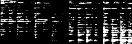
    

    

        <audio src="demo_page/ProjectedGAN/Drum/SCNN/5.wav" controls="" preload=""></audio>
    

* Projected StyleGAN2 (Fusion)

    

        <audio src="demo_page/ProjectedGAN/Drum/Fusion/1006.wav" controls="" preload=""></audio>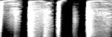
    

    

        <audio src="demo_page/ProjectedGAN/Drum/Fusion/3827.wav" controls="" preload=""></audio>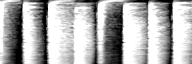
    

    

        <audio src="demo_page/ProjectedGAN/Drum/Fusion/3539.wav" controls="" preload=""></audio>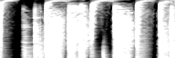
    

    

        <audio src="demo_page/ProjectedGAN/Drum/Fusion/4507.wav" controls="" preload=""></audio>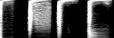
    

    

        <audio src="demo_page/ProjectedGAN/Drum/Fusion/5502.wav" controls="" preload=""></audio>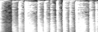
    

    

        <audio src="demo_page/ProjectedGAN/Drum/Fusion/5851.wav" controls="" preload=""></audio>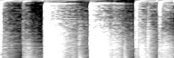
    

#### Synth Loops

* Real

    

        <audio src="demo_page/ProjectedGAN/Synth/Real/0.wav" controls="" preload=""></audio>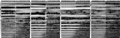
    

    

        <audio src="demo_page/ProjectedGAN/Synth/Real/4.wav" controls="" preload=""></audio>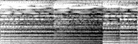
    

    

        <audio src="demo_page/ProjectedGAN/Synth/Real/499.wav" controls="" preload=""></audio>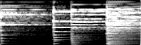
    

    

        <audio src="demo_page/ProjectedGAN/Synth/Real/498.wav" controls="" preload=""></audio>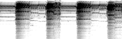
    

    

        <audio src="demo_page/ProjectedGAN/Synth/Real/483.wav" controls="" preload=""></audio>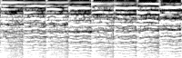
    

    

        <audio src="demo_page/ProjectedGAN/Synth/Real/342.wav" controls="" preload=""></audio>
    

* StyleGAN2

    

        <audio src="demo_page/ProjectedGAN/B/0.wav" controls="" preload=""></audio>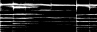
    

    

        <audio src="demo_page/ProjectedGAN/B/6.wav" controls="" preload=""></audio>
    

    

        <audio src="demo_page/ProjectedGAN/B/249.wav" controls="" preload=""></audio>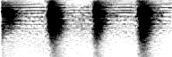
    

    

        <audio src="demo_page/ProjectedGAN/B/1353.wav" controls="" preload=""></audio>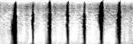
    

    

        <audio src="demo_page/ProjectedGAN/B/1002.wav" controls="" preload=""></audio>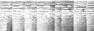
    

    

        <audio src="demo_page/ProjectedGAN/B/460.wav" controls="" preload=""></audio>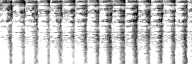
    

* Projected StyleGAN2 (VGG)

    

        <audio src="demo_page/ProjectedGAN/Synth/VGG/1005.wav" controls="" preload=""></audio>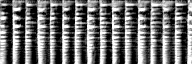
    

    

        <audio src="demo_page/ProjectedGAN/Synth/VGG/177.wav" controls="" preload=""></audio>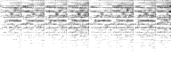
    

    

        <audio src="demo_page/ProjectedGAN/Synth/VGG/1123.wav" controls="" preload=""></audio>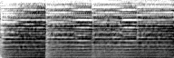
    

    

        <audio src="demo_page/ProjectedGAN/Synth/VGG/474.wav" controls="" preload=""></audio>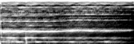
    

    

        <audio src="demo_page/ProjectedGAN/Synth/VGG/1004.wav" controls="" preload=""></audio>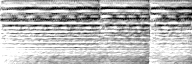
    

    

        <audio src="demo_page/ProjectedGAN/Synth/VGG/2006.wav" controls="" preload=""></audio>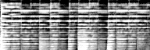
    

* Projected StyleGAN2 (SCNNLoop)

Note: Turn down the volume first. It is pretty loud and noisy.

    

        <audio src="demo_page/ProjectedGAN/Synth/SCNN/0.wav" controls="" preload=""></audio>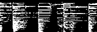
    

    

        <audio src="demo_page/ProjectedGAN/Synth/SCNN/1.wav" controls="" preload=""></audio>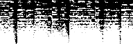
    

    

        <audio src="demo_page/ProjectedGAN/Synth/SCNN/2.wav" controls="" preload=""></audio>
    

    

        <audio src="demo_page/ProjectedGAN/Synth/SCNN/3.wav" controls="" preload=""></audio>
    

    

        <audio src="demo_page/ProjectedGAN/Synth/SCNN/4.wav" controls="" preload=""></audio>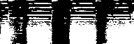
    

    

        <audio src="demo_page/ProjectedGAN/Synth/SCNN/5.wav" controls="" preload=""></audio>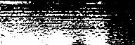
    

* Projected StyleGAN2 (Fusion)

    

        <audio src="demo_page/ProjectedGAN/Synth/Fusion/254.wav" controls="" preload=""></audio>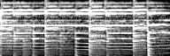
    

    

        <audio src="demo_page/ProjectedGAN/Synth/Fusion/8001.wav" controls="" preload=""></audio>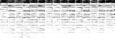
    

    

        <audio src="demo_page/ProjectedGAN/Synth/Fusion/498.wav" controls="" preload=""></audio>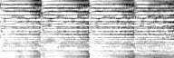
    

    

        <audio src="demo_page/ProjectedGAN/Synth/Fusion/2002.wav" controls="" preload=""></audio>
    

    

        <audio src="demo_page/ProjectedGAN/Synth/Fusion/2072.wav" controls="" preload=""></audio>
    

    

        <audio src="demo_page/ProjectedGAN/Synth/Fusion/9723.wav" controls="" preload=""></audio>
    

